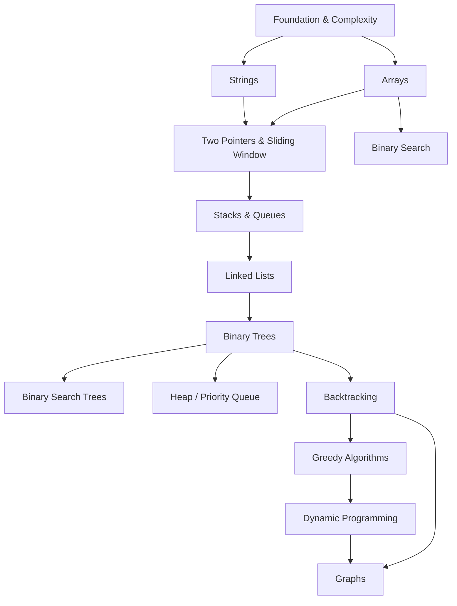

# Most Important DSA Questions and Answers

Welcome to the **Most Important DSA Questions and Answers** handbook!

This documentation is a comprehensive, battle-tested compilation of essential Data Structures & Algorithms (DSA) patterns, high-frequency interview questions, intuition walkthroughs, complexity analyses, and multi-language solutions.

---

## 🎯 Target Audience & Goals

- **Target Audience:** Software engineers, computer science students, and tech professionals preparing for technical interviews at FAANG / Big Tech, unicorns, and high-growth engineering teams.
- **Primary Goal:** Transform algorithmic pattern recognition into second nature. Instead of memorizing hundreds of ad-hoc problems, master the core 14 fundamental topics and their signature patterns.

---

## 🧭 Topic Roadmap

Click any section below to navigate to its dedicated module:

### Module Index

1. **[Foundation & Complexity](01-foundation/README.md)**  
   *Big-O notation, asymptotic upper/lower bounds, Bit Manipulation tricks, and essential Math foundations.*
2. **[Arrays](02-arrays/README.md)**  
   *Prefix sums, Kadane's algorithm, Dutch National Flag, cycle sort, and in-place matrix manipulations.*
3. **[Linked Lists](03-linked-list/README.md)**  
   *Floyd's cycle detection, dummy heads, in-place pointer reversal, and LRU Cache design.*
4. **[Strings](04-strings/README.md)**  
   *Frequency arrays, anagram grouping, rolling hash, palindrome verification, and string transformations.*
5. **[Stacks and Queues](05-stacks-and-queues/README.md)**  
   *Monotonic stacks, next greater elements, largest histogram rectangles, and monotonic sliding deques.*
6. **[Binary Search](06-binary-search/README.md)**  
   *Classic search, rotated sorted arrays, search space reduction, and binary search on the answer.*
7. **[Two Pointers & Sliding Window](07-two-pointers-sliding-window/README.md)**  
   *Opposite ends collision, fast/slow runners, fixed-length windows, and dynamically expanding/shrinking windows.*
8. **[Binary Trees](08-binary-tree/README.md)**  
   *DFS (Pre, In, Post), BFS Level-Order, Tree diameter, Lowest Common Ancestor (LCA), and path sums.*
9. **[Binary Search Trees](09-binary-search-tree/README.md)**  
   *BST invariant properties, validation, in-order predecessor/successor, and balancing techniques.*
10. **[Heap / Priority Queue](10-heap/README.md)**  
    *Min-heaps, max-heaps, Top-K frequent elements, streaming medians (two-heap technique), and K-way merges.*
11. **[Backtracking](11-backtracking/README.md)**  
    *Decision trees, pruning states, combinations, permutations, subsets, and N-Queens constraint satisfaction.*
12. **[Greedy Algorithms](12-greedy/README.md)**  
    *Optimal substructure, greedy choice property, interval scheduling, jump game, and gas station.*
13. **[Dynamic Programming](13-dynamic-programming/README.md)**  
    *Top-down memoization, bottom-up tabulation, space optimization, 0/1 Knapsack, LCS, and LIS.*
14. **[Graphs](14-graphs/README.md)**  
    *Adjacency lists/matrices, BFS/DFS traversals, Kahn's Topological Sort, Dijkstra's algorithm, and Union-Find (Disjoint Set Union).*

---

## 📋 Standard Solution Template Structure

Each question in this handbook follows a disciplined four-pillar pattern:

1. **Problem Statement:** Clear prompt, constraints, inputs/outputs, and edge conditions.
2. **Intuition & Approach:** Mental model, naive vs. optimal transitions, and step-by-step logic.
3. **Complexity Analysis:** Mathematical proof of Big-$O$ Time and Space bounds.
4. **Code Implementation:** Idiomatic solutions in Python, C++, Java, and TypeScript.

---

## ⚡ Complexity Reference Card

| Notation | Common Name | Typical Example | Acceptable Input Size ($N$) |
|---|---|---|---|
| $O(1)$ | Constant | Array lookup, Hash table insert/lookup | Any size |
| $O(\log N)$ | Logarithmic | Binary search, BST operations | $N \le 10^{18}$ |
| $O(N)$ | Linear | Single pass array traversal, Sliding window | $N \le 10^7$ |
| $O(N \log N)$ | Linearithmic | Merge Sort, Heap operations, Divide & Conquer | $N \le 10^6$ |
| $O(N^2)$ | Quadratic | Nested loops, Bubble sort, Matrix operations | $N \le 10^4$ |
| $O(2^N)$ | Exponential | Subsets generation, recursive Fibonacci | $N \le 20$ |
| $O(N!)$ | Factorial | Generating all permutations | $N \le 11$ |
